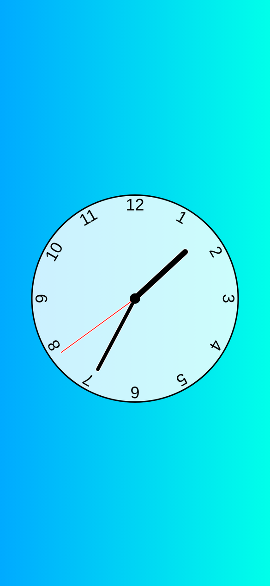

# 🕰️ Analog Clock

A working analog clock built with plain **HTML**, **CSS** and **JavaScript**. The hour, minute and second hands move in real time based on your device's clock.


<p align="center"></p>

## ✨ Features

- Hour, minute and second hands that update every second
- Smooth positioning — the minute hand accounts for seconds, and the hour hand for minutes, so hands sit between numbers like a real clock
- Numbers 1–12 positioned around the clock face with CSS
- No libraries or frameworks

## ⚙️ How It Works

Every second, `script.js` reads the current time and works out how far around the clock each hand should be as a ratio (0–1). It then sets a CSS custom property, `--rotation`, on each hand, and the stylesheet turns that into a `rotate()` transform.

```js
const secondsRatio = currentDate.getSeconds() / 60
const minutesRatio = (secondsRatio + currentDate.getMinutes()) / 60
const hoursRatio   = (minutesRatio + currentDate.getHours()) / 12
```

## 📁 Project Structure

```
├── index.html   # Clock face, hands and numbers
├── styles.css   # Layout, hand styling and rotation
└── script.js    # Time calculation and hand updates
```

## 🚀 Getting Started

No setup needed — clone the repo and open `index.html` in your browser.

```bash
git clone https://github.com/Scarface96/clock-app.git
```

## 📚 What I Learned

DOM selection with data attributes, `setInterval`, the JavaScript `Date` object, and driving CSS transforms from JavaScript using CSS custom properties.

---

👤 **Tony Mulunda** — [GitHub @Scarface96](https://github.com/Scarface96)

## About This Project

A real-time analog clock built with vanilla HTML, CSS and JavaScript. It demonstrates DOM manipulation, JavaScript date/time handling, timed updates and the use of CSS transforms and custom properties to create a dynamic interface.
